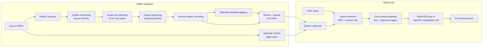

# RAG-Flow

RAG-Flow is a multimodal retrieval-augmented generation pipeline for technical
manuals. It turns PDF manuals into auditable evidence objects, indexes them with
hybrid text and optional visual retrieval, and serves source-grounded answers
through an OpenAI-compatible language model.

The project was built around a practical question: how do we make RAG reliable
on manuals where the answer may live in prose, tables, screenshots, diagrams,
inline icons, page layout, or several pages at once?

## Highlights

- End-to-end PDF pipeline: MinerU parsing, PDF-outline sectioning, small-icon
  repair, image captioning, section-aware chunking, Qdrant indexing, retrieval,
  and answering.
- Hybrid retrieval: dense vectors, sparse BM25-style vectors, reciprocal rank
  fusion, and optional ColPali page-level visual retrieval.
- Source-first design: every block, chunk, retrieved context, and answer payload
  carries source identity, page information, section breadcrumbs, and audit
  metadata.
- Thesis-scale evaluation: 88 answer-bearing runs, 6,001 generated answers, and
  18,003 independent review judgments over a 14-PDF technical-manual corpus.
- Deployable presets: named runtime modes for low, medium, and high text
  budgets, plus image-input and visual-recall variants.

## System Overview



## Why This Exists

Technical manuals are a poor fit for naive text-only RAG. Important evidence can
appear as:

- a table row with repeated headers,
- a small UI icon dropped by OCR,
- a screenshot caption that explains a workflow,
- a visual dimension drawing with almost no extracted text,
- a procedure split across section boundaries,
- or a comparison across several PDF files.

RAG-Flow treats these cases as first-class system problems. The pipeline enriches
manuals before indexing, keeps the medium preset conservative, and exposes
heavier multimodal modes only when their cost is justified.

## Pipeline Contract

| Stage | Input | Output | Purpose |
| --- | --- | --- | --- |
| `parsing` | Source PDF | MinerU `content_list.json`, images, origin PDF | Extract layout-aware blocks and assets. |
| `sectioning` | MinerU JSON + source PDF | `*_SECTIONED.json` | Add source identity and PDF-outline breadcrumbs before LLM enrichment. |
| `patching` | Sectioned JSON + source PDF | `*_SECTIONED_PATCHED.json`, patching view PDF | Repair small inline icons and missing visual symbols. |
| `captioning` | Sectioned patched JSON | `*_SECTIONED_PATCHED_CAPTIONED.json`, captioning view PDF | Describe real image blocks and record whether images may be needed during answering. |
| `chunking` | Captioned JSON | `*_CHUNKED.json`, chunking view PDF | Build source-aware, section-aware retrieval units. |
| `tagging` | Chunked JSON + source `metadata.yml` | `*_CHUNKED_TAGGED.json` | Optional stage controlled by `RAG_FLOW_TAGGING_ENABLED`; add document-level product, model, version, language, and topic tags to chunk payloads. |
| `indexing` | Chunked or tagged JSON + PDF pages | Qdrant text and optional visual points | Store dense text, sparse text, and optional ColPali page vectors. Uses tagged JSON only when tagging is enabled. |
| `retrieval` | Qdrant collection + query | Ranked chunks, context text, optional image URLs | Build the final answer payload under explicit top-k and token rules. |
| `answering` | Retrieval final output | LLM answer, usage, latency, review inputs | Generate source-grounded answers without silently choosing extra evidence. |

`tagging` is disabled by default. When `RAG_FLOW_TAGGING_ENABLED=0`, indexing
uses `*_CHUNKED.json` directly and the source root does not need `metadata.yml`.
When `RAG_FLOW_TAGGING_ENABLED=1`, the pipeline requires `metadata.yml` in the
source root and indexes `*_CHUNKED_TAGGED.json`.

## Evaluation Snapshot

The final experiments used a mixed technical-manual corpus: long DSS software
manuals plus visually dense camera and switch sheets.

| Item | Count |
| --- | ---: |
| Source PDFs | 14 |
| Source pages | 1,114 |
| Final validation questions | 200 |
| Evidence items in the gold set | 244 |
| Answer-bearing runs | 88 |
| Generated answers | 6,001 |
| Independent review pass judgments | 18,003 |

### Final Presets

Scores are mean 0-5 answer-quality scores from the final 200-question validation
unless noted otherwise. The built-in runtime default is `low`.

| Preset | Route | Main settings | Mean score | Avg retrieved context | Use when |
| --- | --- | --- | ---: | ---: | --- |
| `extra-low` | text-only | `k=150`, `top_k=10`, ratio `0.2`, 10k cap | not separately run on 200Q | lower than `low` expected | Noisy retrieval where stricter evidence pruning is preferred. |
| `low` | text-only | `k=150`, `top_k=10`, ratio `0.4`, 10k cap | 2.3833 | ~4,156 tokens | Low-token use, batch previews, and high-volume support drafting. |
| `medium` | text-only | `k=80`, `top_k=20`, 10k cap | 2.3383 | ~10,072 tokens | Normal online QA with stable latency and simple deployment. |
| `high` | text-only | `k=150`, `top_k=80`, 16k cap | 2.4133 | ~16,585 tokens | Hard questions, manual review, or maximum evidence coverage. |
| `low-with-image-input` | low retrieval + images to answerer | selected evidence images appended | not separately run on 200Q | ~4,156 text tokens expected | Image diagnostics with smaller text context. |
| `medium-with-image-input` | medium retrieval + images to answerer | selected evidence images appended | 2.3183 | ~10,251 text tokens | Diagnostics when the answerer must inspect images. |
| `medium-with-visual-recall` | ColPali-assisted retrieval | naive page visual bonus, `k=150`, `top_k=20`, 10k cap | 2.3483 | ~10,315 tokens | UI-heavy or diagram-heavy queries where slower retrieval is acceptable. |

Important negative findings:

- `24k` context is not shipped. It produced 124 usage-missing cases in the
  200-question validation under the current serving limit.
- Thinking mode is not enabled by default. It reduced quality and increased
  latency in the measured runs.
- Always sending images is not the default. Repaired image-input runs delivered
  1,378 image URLs to the answerer, but did not improve mean quality.

## Quick Start

### 1. Install the core package

```bash
cd RAG-Flow

mkdir -p .local
cp .local.example .local/rag-flow.env

pip install -e ".[text-retrieval]"
```

Use the full local stack when you need MinerU, patching, captioning, and visual
retrieval on the same machine:

```bash
pip install -e ".[mineru,preprocess,retrieval]"
```

The lighter `text-retrieval` extra is enough for the default online text path.
The visual stack pulls in heavier Torch, ColPali, and related dependencies.

### 2. Configure local paths

RAG-Flow automatically reads `.local/rag-flow.env` from the repository root.
Keep private paths, API keys, source PDFs, model paths, and machine-specific
settings there.

Common local layout:

```text
.local/CUSTOM_DATA/pdfs/source/   input PDF root
.local/CUSTOM_DATA/pdfs/output/   MinerU and preprocessing artifacts, preserving source subfolders
.local/CUSTOM_DATA/qdrant-db/     local Qdrant vector database
.local/CUSTOM_DATA/logs/          local model-server logs
.local/                    private env file, secrets, local-only state
```

### 3. Run the offline pipeline

```bash
rag-flow mineru doctor
rag-flow mineru run --input .local/CUSTOM_DATA/pdfs/source --output-dir .local/CUSTOM_DATA/pdfs/output
rag-flow ingest
```

By default this runs through text indexing. To include the optional page-level
ColPali visual index in the same staged pipeline, use:

```bash
RAG_FLOW_INDEX_MODE=both rag-flow ingest
```

### 4. Start retrieval and answer questions

```bash
rag-flow retriever
rag-flow chat
```

Useful alternatives:

```bash
rag-flow --preset medium chat
rag-flow --preset high chat
rag-flow --preset medium-with-visual-recall test-retriever "Which port is used for power?"
rag-flow --preset medium-with-image-input chat
```

## Command Map

All user-facing operations are exposed through one command:

```bash
rag-flow mineru doctor
rag-flow mineru setup
rag-flow mineru run
rag-flow section
rag-flow patch
rag-flow patch-view
rag-flow caption
rag-flow caption-view
rag-flow chunk
rag-flow chunk-view
rag-flow index text
rag-flow index visual
rag-flow index inspect
rag-flow retriever
rag-flow test-retriever "How do I configure alarms?"
rag-flow chat
rag-flow preset list
rag-flow preset show medium
rag-flow benchmark --help
```

Most script-backed setup commands support `--dry-run`:

```bash
rag-flow init china-all --dry-run
rag-flow env create-mineru --dry-run
rag-flow env create-pipeline --dry-run
rag-flow serve llm-sglang --dry-run
```

## Named Presets

Presets set retrieval and answering environment variables without hand-editing
the env file.

```bash
rag-flow preset list
rag-flow preset show high
rag-flow retriever
```

You can also set a preset in `.local/rag-flow.env`:

```env
RAG_FLOW_PRESET=high
```

Explicit environment variables override preset values. Remove hand-written
retrieval variables when you want a named preset to control the full policy.
The previous names (`default`, `high-recall`, `compact`, `visual-recall`, and
their image-input variants) are accepted as compatibility aliases, but
`preset list` and `preset env` print the canonical names above.

## Configuration

The full environment surface is documented in `.env.example`. The most important
families are:

| Family | Examples | Purpose |
| --- | --- | --- |
| Source and artifacts | `RAG_FLOW_SOURCE_ROOT`, `RAG_FLOW_MINERU_OUTPUT_DIR`, `RAG_FLOW_CONTENT_JSON` | Locate PDFs and stage outputs. |
| Patching | `RAG_FLOW_VLM_BASE_URL`, `RAG_FLOW_VLM_MODEL`, `RAG_FLOW_PATCH_DPI`, `RAG_FLOW_PATCH_CONCURRENCY` | Control vision-model small-icon repair. |
| Captioning | `RAG_FLOW_VLM_BASE_URL`, `RAG_FLOW_VLM_MODEL`, `RAG_FLOW_CAPTION_MAX_CONTEXT_TOKENS` | Control vision-model image-description generation. |
| Chunking | `RAG_FLOW_CHUNK_MODE`, `RAG_FLOW_CHUNK_MAX_TOKENS`, `RAG_FLOW_CHUNK_OVERLAP_TOKENS` | Shape retrieval units. |
| Indexing | `RAG_FLOW_DB_PATH`, `RAG_FLOW_QDRANT_URL`, `RAG_FLOW_COLLECTION`, `RAG_FLOW_INDEX_MODE` | Configure local or server Qdrant. |
| Retrieval | `RAG_FLOW_RETRIEVAL_K`, `RAG_FLOW_FINAL_TOP_K`, `RAG_FLOW_RRF_K`, `RAG_FLOW_RETRIEVAL_MAX_CONTEXT_TOKENS` | Select evidence for answering. |
| Model serving | `RAG_FLOW_VLM_SERVER_AUTO_START`, `RAG_FLOW_LLM_SERVER_AUTO_START`, `RAG_FLOW_VLM_SGLANG_MODEL_ID`, `RAG_FLOW_LLM_SGLANG_MODEL_ID` | Optionally start the VLM only for patching/captioning and the LLM only for chat/answering. |

Patching and captioning use the VLM endpoint (`RAG_FLOW_VLM_BASE_URL`,
`RAG_FLOW_VLM_MODEL`). If `RAG_FLOW_VLM_SERVER_AUTO_START=1`, ingest starts that
server before the first patching/captioning stage that actually runs, then stops
it after the last such stage to free VRAM. Chat and answering benchmarks use the
LLM endpoint (`RAG_FLOW_LLM_BASE_URL`, `RAG_FLOW_LLM_MODEL`); setting
`RAG_FLOW_LLM_SERVER_AUTO_START=1` starts the answer model only when answers are
generated, so retrieval-only and `--skip-answering` runs do not load it.

The built-in chunking default is `auto` mode with `max_tokens=1500`,
`overlap_tokens=150`, and `min_tokens=150`.

## Repository Layout

```text
src/rag_flow/
  cli.py                    Unified command dispatcher
  config.py                 Environment loading and settings
  mineru.py                 MinerU setup and parsing helpers
  sectioning.py             PDF-outline section annotation
  preprocessing/            Small-icon patching, image captioning, view PDFs
  chunking.py               Section-aware and token-window chunking
  tagging.py                Source metadata.yml tagging for chunk payloads
  indexing.py               Qdrant text and visual indexing
  retrieval.py              Hybrid retrieval and context assembly
  api.py                    FastAPI retrieval service
  chat_cli.py               Terminal answering client
  presets.py                Canonical runtime presets
  benchmark/                Experiment and review utilities

scripts/
  env/                      Environment creation helpers
  experiments/              V2 experiment runners and summarizers
  init/                     Machine/bootstrap helpers
  llm/                      SGLang model download helper
  remote/                   Remote-machine helper scripts

qa-goldset/                 Gold questions, evidence cards, review helpers
.local/CUSTOM_DATA/pdfs/source/    Local source PDF tree
.local/CUSTOM_DATA/pdfs/output/    Generated parse/enrichment artifacts
docs/                       Architecture notes and operational docs
tests/                      Unit and regression tests
```

## Development

```bash
pip install -e ".[dev,text-retrieval]"
pytest
```

Run only a focused test while developing:

```bash
pytest tests/test_presets.py
pytest tests/test_chunking.py
```

## Security and Data Hygiene

- Do not commit private manuals, API keys, SSH details, model credentials, or
  raw customer data.
- Put local configuration in `.local/rag-flow.env`; `.local/` is ignored by Git.
- If the retriever is exposed beyond localhost, set
  `RAG_FLOW_RETRIEVER_API_KEY` and send `Authorization: Bearer <token>`.
- Runtime artifacts such as Qdrant databases, downloaded models, and generated
  PDF overlays should stay in ignored local paths unless deliberately published.

## Related Documents

- [Architecture notes](docs/architecture.md)
- [ColPali environment notes](docs/colpali-environment.md)
- [Migration notes](docs/migration.md)
- [Known issues](docs/known-issues.md)
- [QA gold set](qa-goldset/README.md)

The Politecnico thesis artifacts in `thesis-polimi/` document the final
experimental narrative and the complete v1/v2 analysis used to choose the
presets above.
