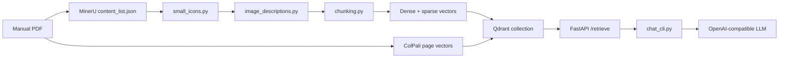

# Architecture

## Data Flow

## Retrieval

The retriever runs three independent searches over the same page-level point ID:

- `page-dense`: multilingual E5 dense text embedding
- `page-sparse`: Qdrant BM25 sparse embedding
- `page-colpali`: ColPali multivector page-image embedding

Results are fused with reciprocal rank fusion. Visual hits are weighted slightly
higher by default because UI manuals often answer questions through screenshots,
tables, and page layout.

## Context Windowing

The top hit gets a wider context window. The next two hits get a smaller window.
Lower-ranked hits contribute their own page only. This keeps citations local
while avoiding very large prompts.

Visual-only continuation pages are linked back to a `parent_page_idx`, which
helps recover table continuation pages that had no MinerU text block.

## Runtime Services

- Retriever service: `rag-flow retriever` on `127.0.0.1:8000`
- LLM service: OpenAI-compatible SGLang endpoint on `127.0.0.1:8080`
- Chat client: `rag-flow chat`
